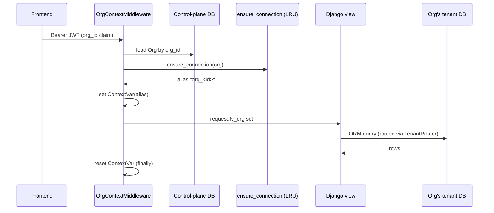

# Architecture

FundVault is multi-tenant: every organisation ("org") gets its own Postgres
database. A separate, small "control plane" database tracks which orgs exist
and how to reach each one's database. This document covers how the pieces
fit together; for endpoint-by-endpoint detail see [api.md](./api.md), and for
a file-by-file backend reference see [backend.md](./backend.md).

## Components

| Component | What it is | Where it runs |
|---|---|---|
| Frontend | Next.js 16 + React 19 app | Vercel |
| Backend API | Django 5.2 (plain function views, no DRF) | Render (gunicorn) |
| Control-plane DB | One Postgres: orgs, join codes, email index | Render (or any Postgres) |
| Tenant DB | One Postgres **per org**: users, sessions, funds, transactions, audit log | Wherever the org's Owner points it (self-hosted, Supabase, Render, …) |
| Object storage | S3-compatible bucket for receipt images, one per org, Owner-supplied | Owner's own provider |
| AI provider | OpenAI-compatible endpoint or Gemini, for receipt extraction, Owner-supplied | Owner's own provider |

The frontend only ever talks to the Django API. It never touches the
control-plane or tenant databases, storage, or AI providers directly.

## Request lifecycle

Every request that needs an org's data carries a signed JWT (`Authorization:
Bearer <token>`) whose payload includes `org_id`. `OrgContextMiddleware`
(`../backend/apps/orgs/middleware.py`) turns that claim into a live database
connection before the view runs:

1. A handful of prefixes (`/api/auth/orgs`, `/api/orgs/create`,
   `/api/orgs/join*`, `/api/orgs/validate-connection`, `/api/health`) are
   public and skip org resolution entirely.
2. For `/api/auth/login`, there's no token yet, so the org comes from the
   request body's `orgId` instead.
3. Otherwise the JWT is decoded (HS256, `FUNDVAULT_JWT_SECRET`) to get
   `org_id`, and the matching `Org` row is loaded from the control plane.
4. `ensure_connection(org)` (`../backend/apps/orgs/connections.py`) registers
   or refreshes a Django database alias `org_<id>` in a **process-local LRU**
   capped at 50 entries. If a cached alias's URL no longer matches the org's
   current `db_connection` (another worker repointed it), the stale
   connection is closed and rebuilt.
5. The alias is stashed in a `ContextVar` (`../backend/apps/orgs/context.py`)
   for the lifetime of the request.
6. `TenantRouter` (`../backend/apps/orgs/router.py`) sends every query from
   the `accounts` and `ledger` apps to that alias; everything else (`orgs`)
   goes to `default`, the control-plane alias. If no org is in context, the
   router **raises** rather than falling back to `default` — a bug in
   context propagation becomes a visible 500, not a cross-tenant data leak.

`auth_required` (`../backend/apps/common/auth.py`) then decodes the same JWT
again and checks a matching `Session` row in the tenant DB (expiry, active
user), setting `request.fv_user`. Views gate writes with
`permissions.require(user, Action.X)` and wrap money writes in
`transaction.atomic(using=current_org_alias())` — a bare `atomic()` opens on
`default` and `select_for_update` on a tenant model then raises.

## Control plane vs tenant databases

| Lives in the **control plane** (`default` alias) | Lives in **each tenant DB** (`org_<id>` alias) |
|---|---|
| `Org` — id, slug, encrypted `db_connection`/`storage_config`/`ai_config` | `User`, `Session` (`apps/accounts`) |
| `JoinCode` — invite codes | `DatabaseFund`, `TransactionFund`, `RecurringTransaction`, `AuditLog`, `TrashItem` (`apps/ledger`) |
| `EmailIndex` — `(email, org)` → which orgs an email belongs to, for login discovery | |

`accounts` and `ledger` are the two Django apps in `TenantRouter.TENANT_APPS`;
their migrations only ever run against tenant aliases (`allow_migrate`
refuses `default` for them, and refuses tenant aliases for `orgs`/
`contenttypes`).

## Org lifecycle

- **Create**: `POST /api/orgs/create` (public, self-service) validates the
  supplied Postgres URL (SSRF guard, see below), migrates it, creates the
  `Org` row, then creates the Owner user/session/audit entry inside that new
  tenant DB. A failure at any point leaves no `Org` row — there's never a
  half-provisioned org.
- **Join codes**: `JoinCode.consume()` is an atomic conditional `UPDATE`
  (uses left, expiry, revoked all checked in one statement), so concurrent
  redemptions can't over-consume a code. Owners can mint codes for any role;
  Admins only for member/viewer (`_mintable_roles` in
  `../backend/apps/orgs/views.py`, which asks the capability table for
  `Action.MINT_ADMIN_CODE`).
- **Login discovery**: the frontend first calls `POST /api/auth/orgs {email}`,
  which looks the email up in `EmailIndex` (control plane) and returns the
  orgs it belongs to — no auth needed, by design (this endpoint intentionally
  reveals org membership for an email). The user picks one, then
  `POST /api/auth/login {orgId, username, password}` authenticates against
  that org's tenant DB.
- **DB repoint**: `PUT /api/orgs/settings` with a `database` section runs
  `migrate_org_database` — probe the new URL, drop the old alias, register
  and migrate the new one, save the new `db_connection`. Other gunicorn
  workers don't see the repoint until their own next `ensure_connection`
  call notices the URL mismatch and rebuilds.
- **Delete**: `DELETE /api/orgs/settings` (Owner, requires typing the org's
  name to confirm) removes **only** the control-plane `Org` row. The tenant
  database itself is never touched or dropped — its data persists until the
  Owner deletes it themselves. The deletion audit entry is written to that
  now-orphaned tenant DB, so it's the only record of who deleted the org and
  when.

## Security model

- **Authentication**: `common/auth.py` mints an HS256 JWT
  (`create_session_token`) with claims `id`, `org_id`, `iat`, `exp`, `jti`.
  A token is only valid while a matching `Session` row still exists in that
  org's tenant DB — logout, a password change, an admin reset, or
  deactivation all delete rows, immediately revoking access. There's no
  `django.contrib.auth`; passwords are hashed directly with bcrypt.
- **Authorization**: a single capability table,
  `../backend/apps/accounts/permissions.py`, maps four roles (Viewer ⊂
  Member ⊂ Admin ⊂ Owner) to actions. `require(user, Action)` returns a 403
  or `None`. Join-code minting resolves through this table too
  (`Action.MINT_ADMIN_CODE`); approval gating (`needs_approval`) sits next to
  it and compares the role directly — see [backend.md](./backend.md) for the
  exact rules.
- **Secrets at rest**: `Org.db_connection`, `storage_config` and `ai_config`
  are Fernet-encrypted (`EncryptedTextField`,
  `../backend/apps/orgs/fields.py`) under `FUNDVAULT_SECRET_KEY`. **That key
  must never change once orgs exist** — every stored credential becomes
  unreadable (`ValueError` on decrypt).
- **SSRF guard**: any tenant-supplied outbound target (the org's Postgres
  URL, S3 endpoint, AI `base_url`) goes through
  `provisioning.resolve_target`/`blocked_https_url_message`
  (`../backend/apps/orgs/provisioning.py`). It resolves the hostname,
  rejects private/loopback/link-local/reserved addresses (unless the exact
  `(host, port)` is in `FUNDVAULT_TENANT_HOST_ALLOWLIST`, used for local
  dev/test only), requires an IPv4 address, and **fails closed** when the
  hostname doesn't resolve at all — rather than letting the later real
  connection attempt re-resolve it unchecked. The validated IP is pinned via
  `hostaddr` for the probe connection and for the migrate-time connection at
  org creation and DB repoint, closing a DNS-rebinding TOCTOU window between
  "checked" and "connected". Runtime reconnections through
  `ensure_connection` are not pinned (that would break provider IP
  failover).
- **AI clients**: both OpenAI-compatible and Gemini clients disable HTTP
  redirect-following (`DefaultHttpxClient(follow_redirects=False)`), so an
  attacker-controlled `base_url` can't 302 the server into an internal
  address after the hostname check has passed.
- **Rate limiting**: `common/ratelimit.py` is a fixed-window counter per
  `REMOTE_ADDR` on Django's in-memory cache — per-worker, reset on restart.
  Behind Render's proxy this may collapse to one shared bucket across all
  clients (see [backend.md](./backend.md) for which endpoints this affects);
  this is a known, unverified limitation, not yet fixed.
- **Receipt URLs**: receipt images live in the org's own bucket; rows store
  only the object key, never a URL. Every read mints a fresh 1-hour SigV4
  presigned URL at serialization time.

## Money correctness

- **Fund row lock**: every money-affecting write takes `SELECT ... FOR
  UPDATE` on the fund row first (`services.lock_fund`), inside
  `transaction.atomic(using=current_org_alias())`. Checks made before
  acquiring the lock (archived/deleted/already-voided) are only fast paths —
  the authoritative check happens under the lock.
- **Balance is always derived, never incremented**: a fund's `balance` is
  the sum of its **approved, non-voided** transactions, and
  `recalculate_running_balances` recomputes every affected row's
  `running_balance` (ordered `date, created_at, id` — that tie-break on `id`
  matters for deterministic ordering when two rows share a timestamp) plus
  the fund total, on every write that changes what counts.
- **Approval threshold**: a debit that would take the fund negative is
  refused at creation and at approval time. Pending (not-yet-approved) rows
  don't move the balance; `needs_approval` applies only to Members, only
  above the org's configured threshold.
- **Recurring processing**: `process_due_recurring` posts **at most one**
  occurrence per due rule per call, dated at processing time (not the
  scheduled date) — an overdue rule needs one call per missed period to
  catch up. A recurring debit that would overdraw the fund is silently
  skipped (its `next_run` still advances, with no audit entry).

## See also

- [backend.md](./backend.md) — module-by-module backend reference
- [api.md](./api.md) — endpoint reference
- [deployment.md](./deployment.md) — how this maps onto Render/Vercel in practice
